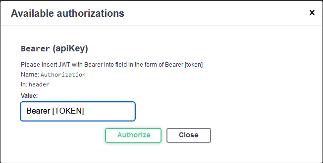

# luigimalgas

# Introduction

The API uses the [CoinMartketCap](https://coinmarketcap.com/api/) API and a user can sign up to get an api token through their website. 

The project uses a clean code design and sticks to the SOLID principles. 

# Usage

The project can be executed in 2 ways:

1. Using the run/ debug project from an IDE such as Visual Studio or Rider. This will open a localhost address with the swagger landing page
2. The solution can be deployed to IIS express on a local machine or server. The provided IIS web address can be used to access the swagger and extract the related calls

## Configuration

The application uses the appsettings implementation and is based on an enviroment variable to determine which appsettings to use. In the project we have a **development** and **produiction** appsettings. The variable to determine which appsettings to use can be changed in the **launchsettings.json** file in the **properties** folder of the **Knab.CryptoVert.API**.

The api endpoints and api keys can be configured in the above files. In order for the application to make calls to the external API it needs an API key for the above mentioned implementation. Once an API key is attained the **[API_KEY]** value can be replaced in the appsettings:

```json

  "ExchangeApi": {
    "Header": "X-CMC_PRO_API_KEY",
    "Url": "https://sandbox-api.coinmarketcap.com/v2",
    "ApiKey": "[API_KEY]"
  }
```

The local/ internal APi also implements atokenize authorization mechanism (basic implementation) and this token can be attained by executing the following command in the root directory of the solution:

```
dotnet user-jwts create --project  Knab.CryptoVert.API
```

and replacing the Authorization header with the following (where [TOKEN] is the token generated from the call above):

```

Bearer [TOKEN]
```
This can be done using the authorize button in swagger and providing the "Bearer [TOKEN]" attribute.



This is a very simple implementation for the sake of the POC. This can be expanded to use IAM and RBAC for added security

# References

1. [CoinMartketCap](https://coinmarketcap.com/api/)
2. [QuoteLatest](https://coinmarketcap.com/api/documentation/v1/#operation/getV2CryptocurrencyQuotesLatest)

## highlighted packages used for single responsibility simplicity: 

- Mediatr
- AutoFixture
- Micriosoft IOptions


